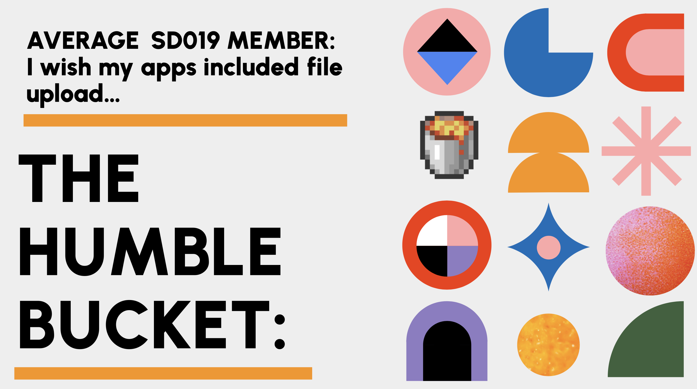
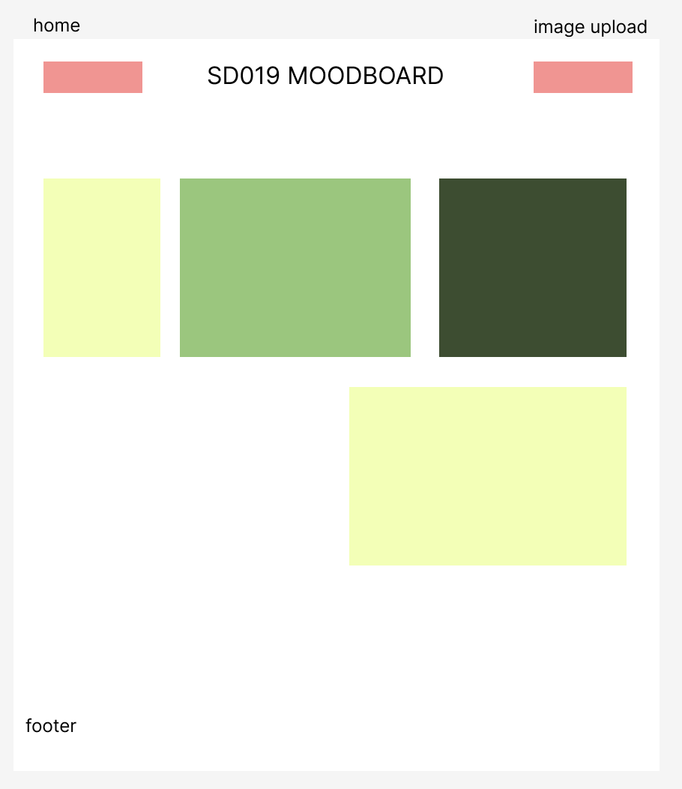

# SD019 Collaborative Image Gallery

A place for our cohort to post and view images (and to learn about Supabase storage)

## Problem Domain & Proposed Solution

Something we both had been interested in for our previous projects (blog posts & social media app) was the ability for users to upload files via our app, and the ability for us to be able to access/manage the files uploaded.

We knew one solution to this was the "Supabase Bucket" - a storage database that accepts several different file types. We just didn't know how to use it ... yet. Our proposed solution in order to create an interactive and informative demo was to create an image gallery for our cohort, which would allow us to understand the process of receiving the files and also displaying them on our page.

## Design

We wanted the user to be able to easily navigate our app and to understand the purpose. Our wireframe was simple and it was clear from our conversation we were on the same page when it came to our aims: the home/landing page would display images in a responsive gallery, and the upload component would be linked in the header. We drew something using Figma, and once we both felt it was both doable and would represent what we wanted to present to the class, we moved onto choosing our colour scheme.

Choosing our colour scheme began by approaching this project as though it were more than just a demo to showcase one feature. We listed the response we wanted our users to have to the site (that it was fun to use, that it created a sense of belonging (since it was for our cohort) and that the colour/contrast choices were made with accessibility in mind). Once we had listed these aims, the decision was made to look for a palette on Coolors that reminded us of the Tech Educator branding colours in order to tie it all together.

## Building

We firstly both built a "test demo" which we tested with our own test buckets in order to make sure we understood the process and what was happening "under the hood" and then worked together to make the presentation demo that was then deployed on Vercel.

The building of the upload component was easier than we expected, thanks to using Supabase UI Library and our new-found confidence in using libraries (which also came in handy when styling our buttons and adding icons). Using these components allowed us to dedicate more time to understanding the process vs following along a "build an upload component" youtube video, and it made sense to us that in a real-world project component libraries would be ultisied in the same way.

The main issue of the project same when we tried to access the images in order to display them on the page. Following the documentation, both together and in a group, we both ran into the same issue, which was that we were accessing an empty array. This issue persisited, no matter the workarounds we tried to take. Eventually, we used an SQL query to access the storage database in much the same way we have been accessing our databases throughout the course, and this worked (b ᵔ▽ᵔ)b

Although we couldn't find documentation online suggesting you access your images this way, it worked for our stress-testing, and seems to have no security concerns when compared to the documenation approach (that we can think of - we also discussed this with Manny). We are both curious to continue our research into this topic and finally put our finger on what wrong step we were taking, but until then we are happy to present something that can help us and our class take that step-up in our projects.

## Reflections

As a group, we are happy with and proud of the project we have made. However, we do have some stretch goals for the project:

📍 Accessibilty goals: Implement a form after uploading which will allow users to set the alt-text for images, and allow images to be tabbable for users who may require a screen-reader or who may not have the dexterity needed to move a mouse.

📍 Handling for special characters. In testing, we realised file names with special characters can break the uploading. Right now this gives the users an error message, but in future we would look into some approaches listed <a href="https://github.com/supabase/storage/issues/133">here</a> to handle them.

### Ryan's reflections

- The project went really well, Quinn and I were on the same page every step of the way and they were really super easy to work with! They had lots of great ideas and contributed a lot to the research and production of the project!

- We ran into an issue trying to get the images the way the documentation says, we still dont know why but we found a way around it using SQL and it seems to work just fine. This was our main blocker but we managed to work it out. Quinn came up with the idea and then I put it into practice in a working test before making a final demo!

- We had a great stand-ups every morning and were always ahead of schedule, this was helped by the thorough planning we did on day 1 with our wireframe, google doc, and Trello board.

- Overall I'm really happy with the end product we've made, its beautifully styled and is a perfect representation of how supabase buckets are useful for making NextJs apps, I hope the rest of the class agrees!

### Quinn's reflections

- The project went incredibly well, Ryan was so clear with communication and had so many ideas for how our demo would act, look and the steps we could take to build it. It was clear even from discussing our communication and conflict plans that we were on the same page with the majority, if not all, of our aims and I had faith that even in the event of a conflict we would be able to work through it (no conflict came up though!)

- I really felt the growth in my confidence using component libraries as an aside in this project, and began to fully understand their usefulness once realising how much time we would have to read documentation while we used ready-made buttons/accordians/etc. I think the site looks good, and preforms well!

- We were ahead of schedule for the whole project, and it was an exciting and fun project to work on. I couldn't have asked for a better teammate, and I hope that the class are able to access the information easily and to use it (should they want to)!

## References & Resources

⭐️ <a href="https://supabase.com/docs/guides/storage/buckets/fundamentals">Supabase Docs</a>

⭐️ <a href="https://supabase.com/ui/docs/nextjs/dropzone">Supabase UI Library - Dropzone</a>

⭐️ <a href="https://www.youtube.com/watch?v=OM9VOxHjTNs">"How to Upload Files using Supabase" Andy's Tech Tutorials</a>

⭐️ <a href="https://ui.shadcn.com">Shadcn Component Library</a>

⭐️ <a href="https://tabler.io/icons">Tabler Icons</a>

⭐️ <a href="https://www.figma.com">Figma</a>

⭐️ <a href="https://coolors.co/211a1d-6320ee-8075ff-f8f0fb-0beaab">Coolors</a>
